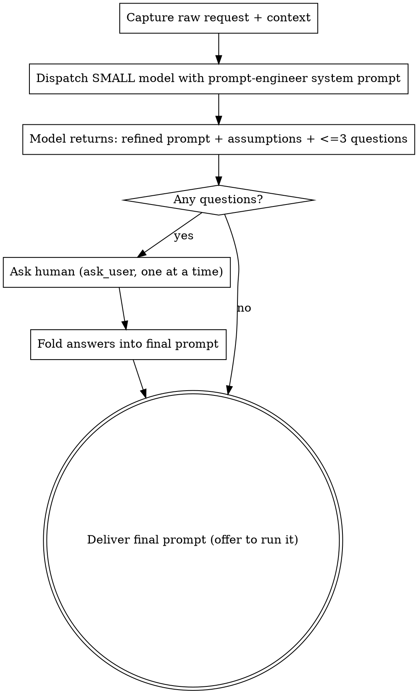

# Prompt-Me: Refine a Prompt With a Small Model First

Turn a rough request into a precise, self-contained prompt for a powerful coding
model — but do the refinement work on a **small, cheap model** and surface at most
**3 clarifying questions** to the human. The expensive model then gets a complete
spec on its first attempt instead of discovering gaps mid-task.

**Core principle:** Spend cheap tokens to save expensive ones. Analysis,
restructuring, and question-finding are mechanical scaffolding — offload them to a
small model so the large model only does the hard engineering.

## When to Use

- A request is vague, one-line, or under-specified ("add auth", "make it faster")
- You're about to hand a task to an expensive/capable model and want it right first try
- You want to cut iteration cycles with a large model
- The human explicitly asks to improve, sharpen, or "prompt me" on a task

**When NOT to use:** the request is already a complete, unambiguous spec, or the
task is trivial and any reasonable interpretation is fine.

## The Loop

## Steps

**1. Capture the raw request and any cheap context.** Take the human's words
verbatim. Add only context you already have (repo stack, key files, constraints).
Don't go investigate the whole codebase — that's the large model's job.

**2. Dispatch the small model.** Use the `task` tool with
`agent_type: "general-purpose"` and `model: "gpt-5.4-mini"` (or another small,
cheap model). Pass the contents of `prompt-engineer-system-prompt.md` as the
dispatch prompt, substituting `{{RAW_REQUEST}}` and `{{CONTEXT}}`. The small model
returns three sections: **REFINED PROMPT**, **ASSUMPTIONS**, **QUESTIONS**.

**3. Ask the human the questions.** Take the (0–3) questions and ask them with the
`ask_user` tool — **one question per call**, using the model's multiple-choice
options as `choices` (put the `(recommended)` one first). If the model returned no
questions, skip straight to delivery. Never exceed 3 questions.

**4. Fold answers back in.** Update the refined prompt with the answers and resolve
the matching assumptions. For small edits do it yourself; if answers change the
shape of the task significantly, re-dispatch the small model with the answers added
to `{{CONTEXT}}`.

**5. Deliver.** Present the final prompt in a copy-pasteable block. Offer to run it
directly with the powerful model, or hand it to the human to use.

## Quick Reference

| Thing | Default |
|-------|---------|
| Helper model | `gpt-5.4-mini` (any small, cheap model) |
| Helper `agent_type` | `general-purpose` |
| Max questions to human | 3 (often 0–1) |
| Question delivery | `ask_user`, one at a time, with options |
| Final prompt sections | Objective, Context, Requirements, Constraints, Acceptance Criteria, Deliverables, Out of Scope |

## Common Mistakes

- **Refining on the expensive model yourself.** Defeats the purpose — dispatch the
  small model to do the analysis.
- **Interrogating the human.** More than 3 questions, or questions whose answers you
  could reasonably assume. Cap at 3; prefer 0–1.
- **Skipping the questions entirely.** If the small model surfaced a real unknown,
  ask it — that's the iteration you're trying to save the large model from.
- **Letting the small model implement the task.** It only refines the prompt.
- **Inventing codebase facts.** Assumptions must be labeled and surfaced, not
  presented as certainty.

## Files

- `prompt-engineer-system-prompt.md` — the system prompt to hand the small model.
